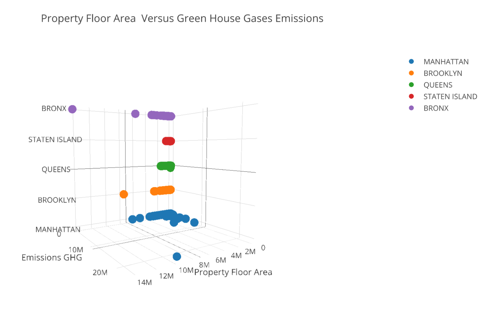

CLARITY: The content of the plot is kind of confusing, because the dots are large and blend together, making it hard to tell how many data points are being analyzed. It's also hard to tell whether there is any movement on the GHG gas axis for Bronx, SI, and Brooklyn, because of the 3D angle.

ESTHETIC: The color scheme is clear. I think having both the legend and the borough axis labels is redundant, and the legend could be removed.

HONESTY: The plot isn't misleading by cropping axes, but the 3D angled perspective does make it hard to compare and interpret the data correctly.

Depending on how many data points there are in each borough, it may be better to make a 2D scatter plot of GHG emissions vs. property floor area with the data points still color coated by borough.

